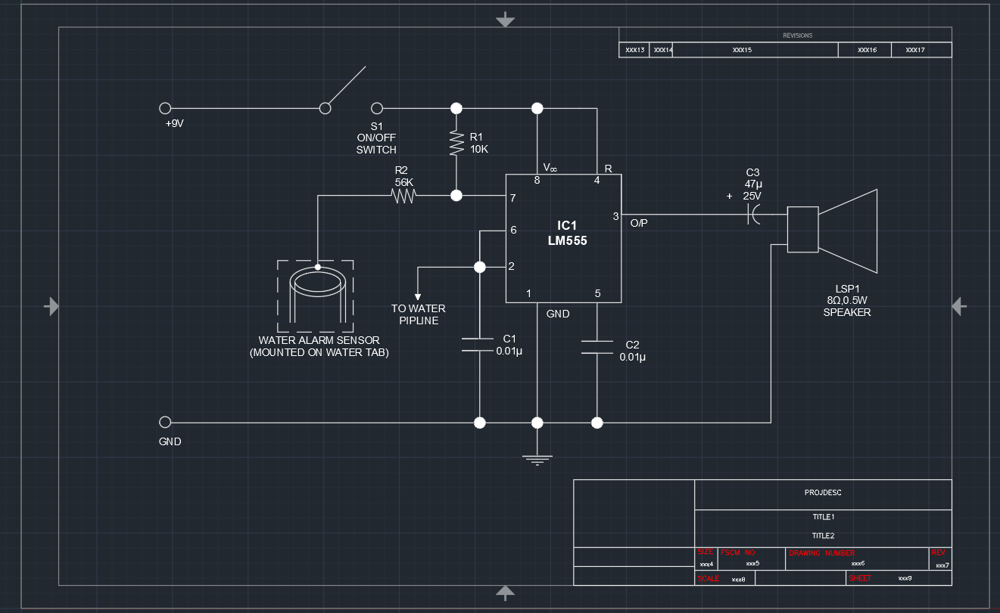

# 🚰 Alarm Circuit for Drinking Water

## 📌 Overview
This project is an AutoCAD-drawn schematic of a water level alarm circuit. It was created to practice technical drawing skills in AutoCAD and understand how water level sensors interact with electronics. The circuit is based on a 555 Timer IC (LM555), which triggers an alarm when water reaches a certain level.

⚠️ **Disclaimer**: I did not design this circuit; I only redrew it in AutoCAD as part of my learning process. The original circuit concept comes from common water-level detection systems used in home and industrial applications.

## 🛠 Circuit Description
This circuit is designed to detect water levels and activate an alarm when a tank or pipe fills up. Here’s how it works:

### 🔹 Power Supply (+9V, GND)
- The circuit is powered by a 9V DC power source.
- The ground (GND) is the common return path for all components.

### 🔹 Water Alarm Sensor
- The sensor is placed on a water tap or pipeline.
- When water reaches the sensor, it completes the circuit and sends a signal to the 555 Timer IC.

### 🔹 555 Timer IC (LM555)
- The heart of the circuit is the 555 Timer IC, configured in astable mode.
- It generates a pulsed output signal when triggered by the sensor.

### 🔹 Resistors & Capacitors
- **R1 (10KΩ)** and **R2 (56KΩ)**: Define the charging time for the 555 Timer.
- **C1 (0.01µF)** and **C2 (0.01µF)**: Stabilize the circuit and filter noise.
- **C3 (47µF, 25V)**: Couples the output to the speaker, preventing DC voltage from damaging it.

### 🔹 Speaker Alarm (LSP1, 8Ω, 0.5W)
- When the 555 Timer activates, it sends a pulsed signal to the speaker.
- The speaker emits a sound, alerting that the water level is high.

## 📂 Included Files
- **ALARM_CIRCUIT_FOR_DRINKING_WATER.dwg** – AutoCAD drawing file
- **ALARM_CIRCUIT_FOR_DRINKING_WATER.png** – Screenshot of the circuit

## 🚀 Why I Made This?
- ✅ To improve AutoCAD electrical drawing skills
- ✅ To understand circuit layout and component interaction
- ✅ To practice technical documentation for engineering projects

## 📷 Screenshot

## 👨‍💻 About Me
**Awab Abdallah** – Electrical & Electronics Engineering Student  
[🔗 GitHub Profile](https://github.com/AwabEEE)  
[🔗 LinkedIn Profile](https://www.linkedin.com/in/awab-abdelhadi-yagoub-abdallah-5a366b354/)

## 📜 License
This drawing is for educational purposes. The original circuit design belongs to its respective creator.
